# Shopify Protected Customer Data Access Guide (Enhanced)

> **Version 2.0** - January 2026
> **Screenshots**: Desktop 1920x1080 captured via Playwright automation
> **Previous Version**: See `/docs/Shopify Protected Customer Data Access Guide/`

## Overview

This comprehensive guide walks through enabling **Protected Customer Data** access for Shopify apps. This is **required** when your app needs to access customer information through:

- **Admin API** - Customer, Order, and related resources
- **Customer Account API** - Customer account data
- **Checkout UI Extensions** - Customer data in checkout flows

### When You Need This

| Use Case | Required? |
|----------|-----------|
| Creating draft orders with customer info | Yes |
| Processing customer data for orders | Yes |
| Building customer management features | Yes |
| Reading/writing customer PII | Yes |
| Headless storefronts accessing customer data | Yes |

### Development vs Production

| Environment | Approval Required? |
|-------------|-------------------|
| Development Store | No - Select reasons and use immediately |
| App Store Distribution | Yes - Shopify reviews your access request |

---

## Prerequisites

Before starting, ensure you have:

- [ ] A Shopify Partner account
- [ ] An app created in your Partner Dashboard
- [ ] The app installed on a development store (for testing)

---

## Step-by-Step Guide

### Step 1: Log in to Shopify Partners

Navigate to [partners.shopify.com](https://partners.shopify.com) and log in with your credentials.

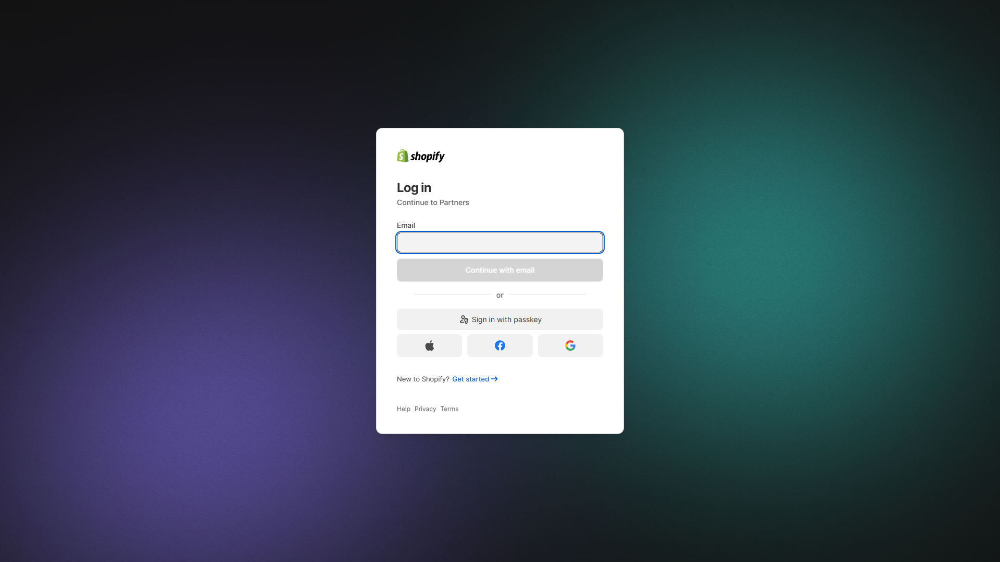

The login page supports:
- Email/password authentication
- Passkey sign-in
- Social login (Apple, Facebook, Google)

---

### Step 2: Access the Partners Dashboard

After logging in, you'll see your Partners Dashboard home page with:

- Getting started checklist
- Stores section
- Business overview
- Partner tier status
- Recent activity

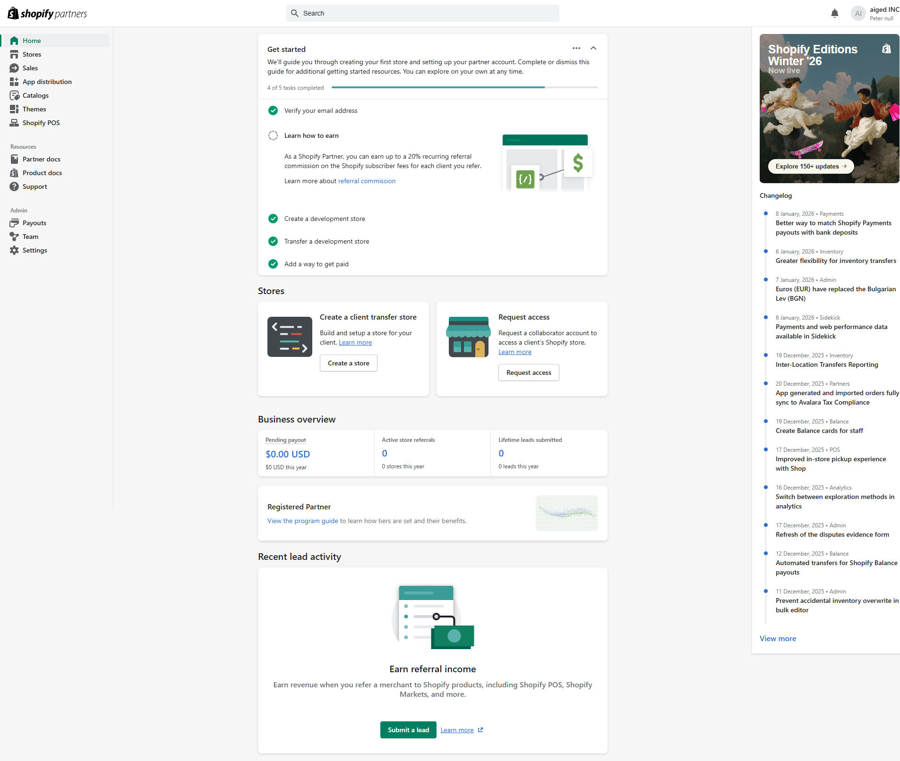

---

### Step 3: Navigate to App Distribution

Click **"App distribution"** in the left sidebar to see all your apps.

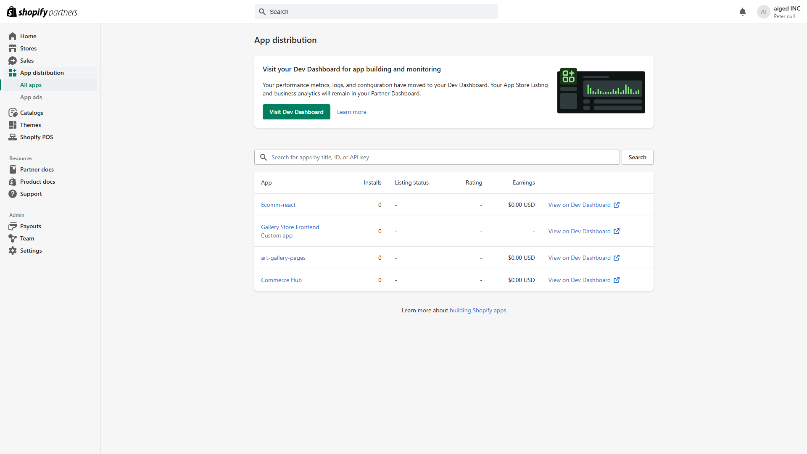

You'll see:
- All your apps listed with install counts
- Listing status
- Ratings
- Earnings
- Links to Dev Dashboard

---

### Step 4: Select Your App

Click on your app name (e.g., "Ecomm-react") to access its settings.

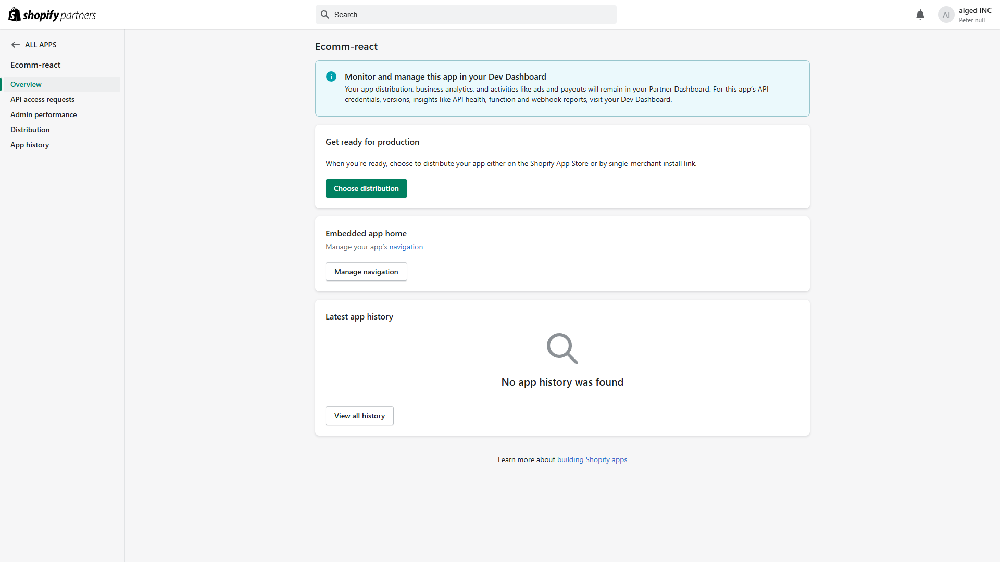

The app overview shows:
- Monitor and manage notice (links to Dev Dashboard)
- Get ready for production section
- Embedded app home settings
- Latest app history

---

### Step 5: Go to API Access Requests

Click **"API access requests"** in the left sidebar under your app name.

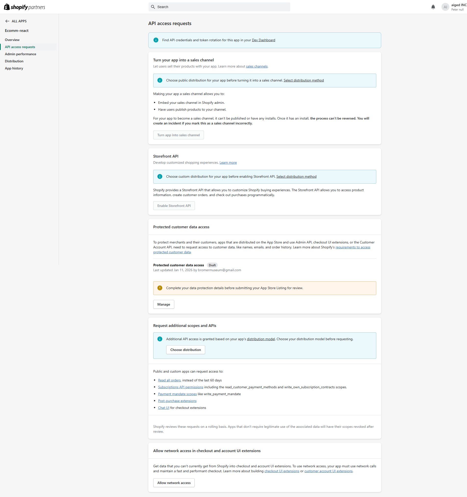

This page contains several sections:

| Section | Purpose |
|---------|---------|
| Turn your app into a sales channel | Enable sales channel features |
| Storefront API | Enable Storefront API access |
| **Protected customer data access** | Configure customer data permissions |
| Request additional scopes and APIs | Request special permissions |
| Allow network access | Enable external network calls |

---

### Step 6: Access Protected Customer Data Settings

Find the **"Protected customer data access"** section and click **"Manage"**.

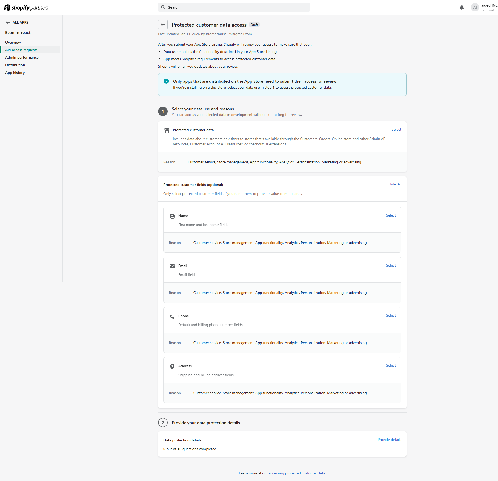

You'll see a two-step process:
1. **Step 1**: Select your data use and reasons
2. **Step 2**: Provide your data protection details

> **Important**: The blue info box confirms that apps on development stores can access protected data immediately after selecting reasons - no review required.

---

### Step 7: Select Data Use Reasons

Click **"Select"** next to "Protected customer data" to open the reasons modal.

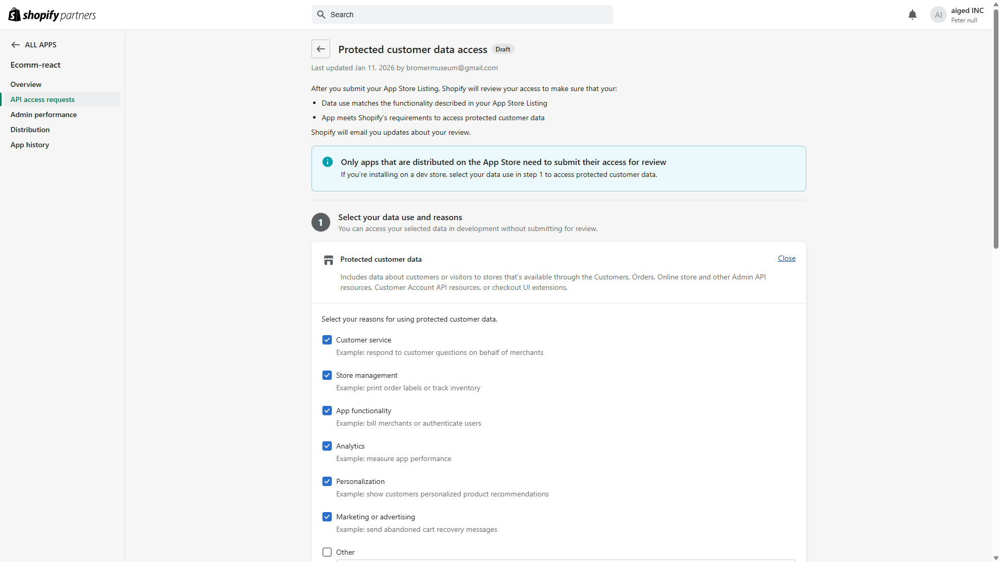

**Available Reasons:**

| Reason | Example Use Case | When to Select |
|--------|-----------------|----------------|
| Customer service | Respond to customer questions on behalf of merchants | Support features |
| Store management | Print order labels or track inventory | **Required for draft orders** |
| App functionality | Bill merchants or authenticate users | Core app operations |
| Analytics | Measure app performance | Performance tracking |
| Personalization | Show customers personalized product recommendations | Recommendation engines |
| Marketing or advertising | Send abandoned cart recovery messages | Marketing features |
| Other | Custom use case (requires description) | Special cases |

Select all applicable reasons and click **"Save"**.

---

### Step 8: Configure Individual Field Access

After setting the main reasons, configure access for each specific field type.

#### 8a. Name Field

Click **"Select"** next to "Name" to configure access to first name and last name fields.

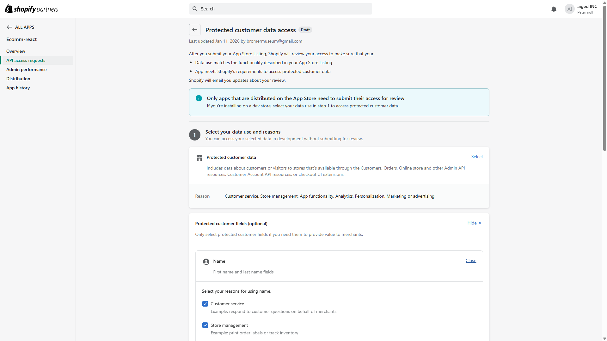

**Grants access to:**
- First name fields
- Last name fields

Select your reasons and click **"Save"**.

---

#### 8b. Email Field

Click **"Select"** next to "Email" to configure email access.

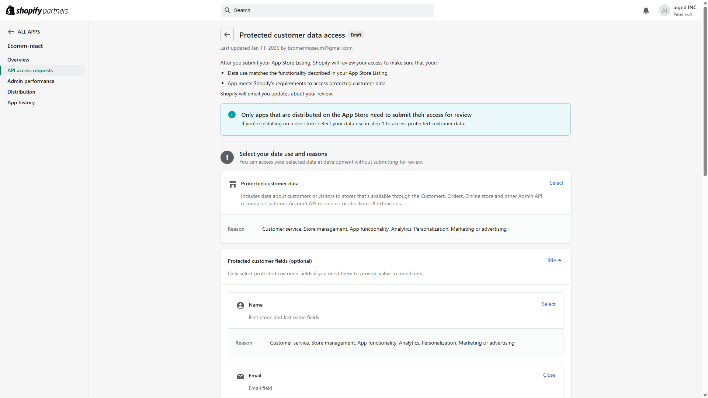

**Grants access to:**
- Customer email addresses

Select your reasons and click **"Save"**.

---

#### 8c. Phone Field

Click **"Select"** next to "Phone" to configure phone number access.

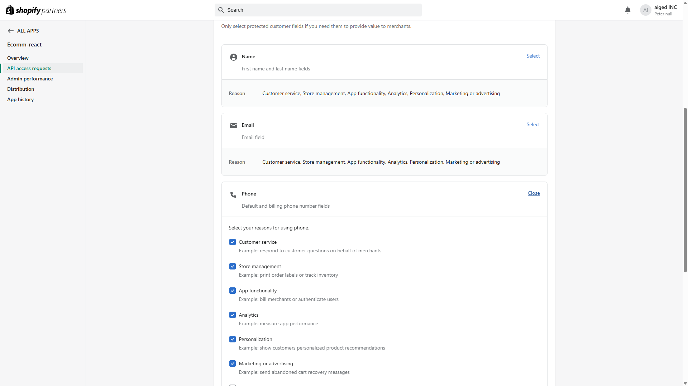

**Grants access to:**
- Default phone number fields
- Billing phone number fields

Select your reasons and click **"Save"**.

---

#### 8d. Address Field

Click **"Select"** next to "Address" to configure address access.


**Grants access to:**
- Shipping address fields
- Billing address fields

Select your reasons and click **"Save"**.

---

### Step 9: Verify All Fields Are Configured

After configuring all fields, your page should show all fields with their selected reasons.

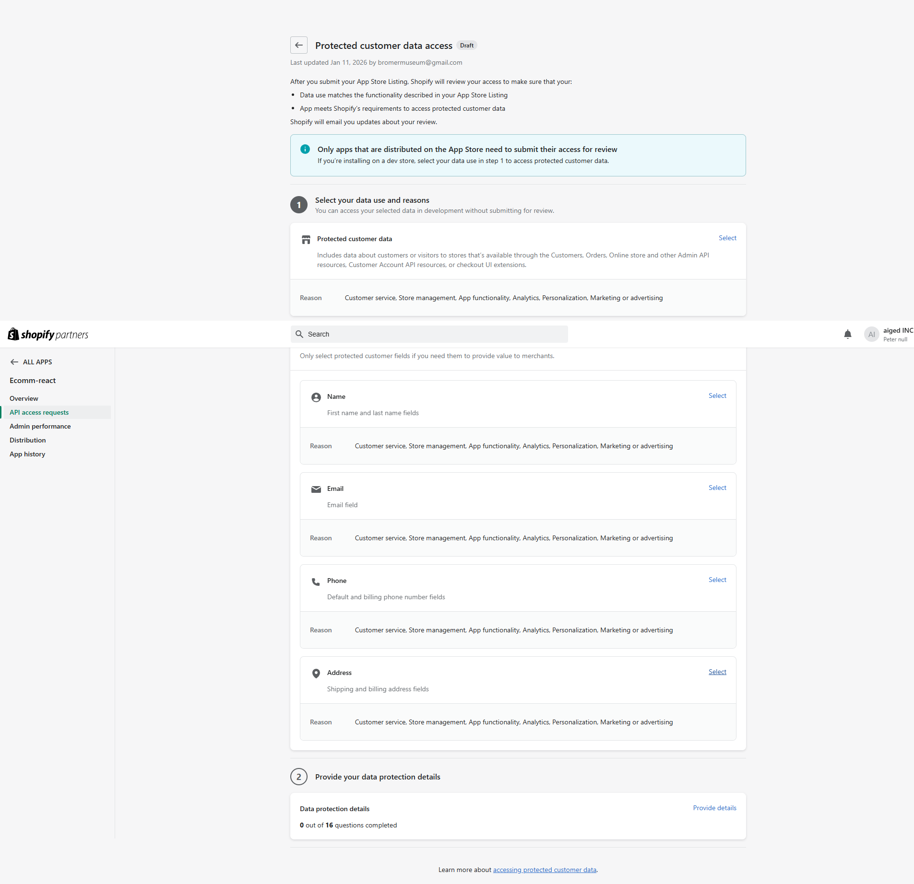

Each field should display:
- The field name and description
- **Reason**: Customer service, Store management, App functionality, Analytics, Personalization, Marketing or advertising

---

### Step 10: Complete Data Protection Details (Step 2)

For App Store distribution, you must also complete the **Data protection details** questionnaire.

Click **"Provide details"** to access the form.

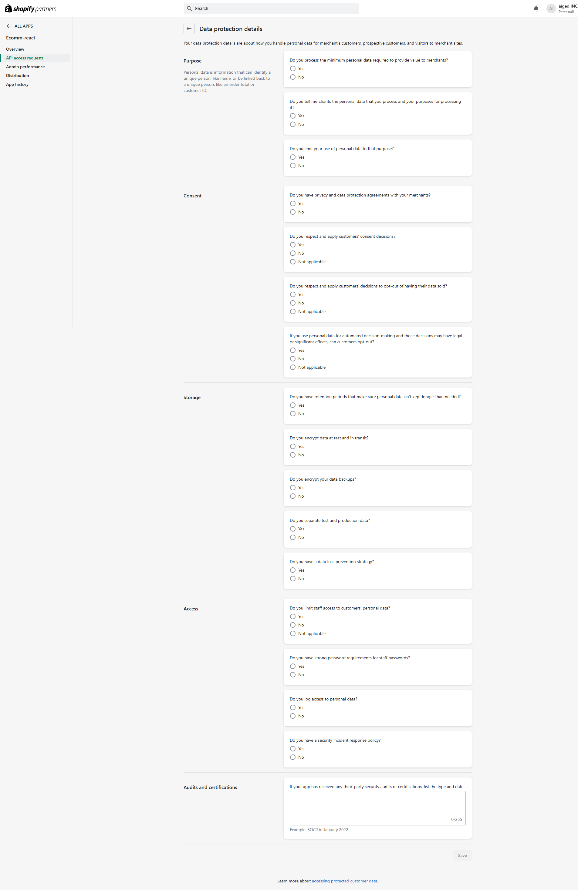

The questionnaire covers **16 questions** in 5 categories:

#### Purpose (3 questions)
- Do you process the minimum personal data required?
- Do you tell merchants what data you process?
- Do you limit use to stated purposes?

#### Consent (4 questions)
- Do you have privacy agreements with merchants?
- Do you respect customer consent decisions?
- Do you respect opt-out of data sale decisions?
- Can customers opt-out of automated decision-making?

#### Storage (5 questions)
- Do you have data retention periods?
- Do you encrypt data at rest and in transit?
- Do you encrypt backups?
- Do you separate test and production data?
- Do you have a data loss prevention strategy?

#### Access (4 questions)
- Do you limit staff access to customer data?
- Do you have strong password requirements?
- Do you log access to personal data?
- Do you have a security incident response policy?

#### Audits and Certifications (1 field)
- List any third-party security audits or certifications (e.g., SOC2)

---

## Verification

After completing all steps, verify your access is working:

1. **Make an API call** that requires customer data
2. **Check for errors** - you should no longer receive `ACCESS_DENIED` errors
3. **Test draft order creation** with customer information

---

## Common Errors & Solutions

### Error: `ACCESS_DENIED` for protected customer fields

**Cause:** Protected customer data access not enabled or not saved properly.

**Solution:**
1. Return to API access requests
2. Verify all fields (Name, Email, Phone, Address) show reasons selected
3. Re-save if necessary
4. Wait a few minutes for changes to propagate

### Error: Can't access customer data in production

**Cause:** Production apps require Shopify approval for protected data access.

**Solution:**
1. Complete the Data protection details questionnaire
2. Submit your App Store Listing for review
3. Wait for Shopify approval (typically 1-5 business days)

### Error: Fields not appearing in GraphQL responses

**Cause:** API scopes may not be configured in your app.

**Solution:**
1. Check your `shopify.app.toml` configuration
2. Ensure required scopes are included
3. Reinstall the app to apply new scopes

---

## Required API Scopes

For draft orders with customer data, ensure your app has these scopes:

```toml
# shopify.app.toml
[access_scopes]
scopes = "read_products,write_products,read_orders,write_orders,read_draft_orders,write_draft_orders,read_customers,write_customers"
```

Or in JavaScript:

```javascript
const SCOPES = [
  'read_products',
  'write_products',
  'read_orders',
  'write_orders',
  'read_draft_orders',
  'write_draft_orders',
  'read_customers',
  'write_customers'
];
```

---

## GraphQL Example

Once protected customer data access is enabled:

```graphql
mutation draftOrderCreate($input: DraftOrderInput!) {
  draftOrderCreate(input: $input) {
    draftOrder {
      id
      name
      totalPrice
      customer {
        id
        firstName
        lastName
        email
      }
    }
    userErrors {
      field
      message
    }
  }
}
```

Variables:
```json
{
  "input": {
    "email": "customer@example.com",
    "shippingAddress": {
      "firstName": "John",
      "lastName": "Doe",
      "address1": "123 Main St",
      "city": "New York",
      "province": "NY",
      "zip": "10001",
      "country": "US"
    },
    "lineItems": [
      {
        "variantId": "gid://shopify/ProductVariant/12345",
        "quantity": 1
      }
    ]
  }
}
```

---

## Summary Checklist

### Step 1: Data Use Selection
- [ ] Logged into Shopify Partners Dashboard
- [ ] Navigated to App distribution > Your App
- [ ] Clicked "API access requests" in sidebar
- [ ] Clicked "Manage" under Protected customer data
- [ ] Selected reasons for Protected customer data (main)
- [ ] Configured Name field with reasons
- [ ] Configured Email field with reasons
- [ ] Configured Phone field with reasons
- [ ] Configured Address field with reasons

### Step 2: Data Protection Details (for App Store apps)
- [ ] Completed Purpose questions (3)
- [ ] Completed Consent questions (4)
- [ ] Completed Storage questions (5)
- [ ] Completed Access questions (4)
- [ ] Added Audits/Certifications info (if applicable)

### Final Verification
- [ ] Tested API access with customer data
- [ ] Confirmed no ACCESS_DENIED errors

---

## Related Resources

- [Shopify Protected Customer Data Documentation](https://shopify.dev/docs/apps/launch/protected-customer-data)
- [Shopify Admin API Scopes](https://shopify.dev/docs/api/usage/access-scopes)
- [Draft Orders API Reference](https://shopify.dev/docs/api/admin-graphql/latest/mutations/draftOrderCreate)
- [Customer Account API](https://shopify.dev/docs/api/customer)

---

## Document Info

| Field | Value |
|-------|-------|
| Created | January 11, 2026 |
| Author | Hydrogen Forge Team |
| Version | 2.0 (Enhanced) |
| Screenshots | 13 (Desktop 1920x1080) |
| Capture Method | Playwright Automation |

---

*This enhanced guide is part of the Hydrogen Forge documentation. Screenshots were captured automatically using Playwright for consistent, high-quality documentation.*
